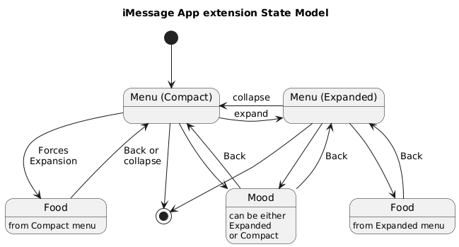

# imHostingVC - coping with expanded vs compact modes
See the overall rationale in the [readme in the parent folder](../README.md).

This sample uses the [url][1] field of MSMessage to send data but its main purpose is to demonstrate the nesting approach to navigating into and out of child VCs, along with setting different preferred sizes of expanded vs compact.

It also shows a general navigation pattern for the iMessage extension apps which copes with the different compact/expanded modes including handling transition when the user expands or collapses the view.

**Bug Warning** checking this sample 2025-06-13 realised it has an outstanding bug that is now logged [GitHub issue 5][5].

## Hosting architecture

Instead of the simple `MessagesViewController` of the other samples, the navigation is factored out into:

- `MessagesTopNavigation` which provides a navigation flow for our different screens, as an extension of `MessagesViewController`
- `MenuViewController` providing the initial UI
- `MessagesViewController` only ever hosting other ViewControllers which handle the interaction

The main influence is Apple's [Ice Cream Builder sample][2].

### Expanded vs Compact states
The Food list requires an Expanded presentation.

The Menu and Mood view controllers can be either in Expanded or Compact states, depending on the state at time of moving to those screens.

### State Transitions


## Comparing to Apple's Icecream Builder
The [icecreambuilder][2] sample is Apple's only sample showing how to build an iMessage app extension (from iOS 10 … 16 at least).

It has a minimal owning app with no user functionality.

Stuff in `MessagesViewController` different from the Touchgram architecture which I need to justify or change:
- `removeAllChildViewControllers` is invoked from both `willTransition` and `presentViewController`
- `instantiateIceCreamsController` and similar factories used to instantiate VCs from the storyboard


## Transitions diagram
<details>
<summary>Using PlantUML</summary>

via [PlantText][3]

```
@startuml
title iMessage App extension State Model

[*] --> CM
CM --> [*]
EM --> [*]
CM --> FfC : Forces\nExpansion
EM --> FfE
FfE --> EM : Back
FfC --> CM : Back or\lcollapse
CM -r-> EM : expand 
EM -l-> CM : collapse
CM --> Mood
EM --> Mood
Mood --> EM : Back
Mood --> CM : Back


state "Menu (Compact)" as CM
state "Menu (Expanded)" as EM
state "Food" as FfE : from Expanded menu
state "Food" as FfC : from Compact menu
state Mood : can be either\nExpanded\nor Compact
@enduml
```


</details>


[1]: https://developer.apple.com/documentation/messages/msmessage/1649739-url
[2]: https://developer.apple.com/documentation/messages/icecreambuilder_building_an_imessage_extension
[3]: https://www.planttext.com
[5]: https://github.com/AndyDentFree/im-plausibilities/issues/5