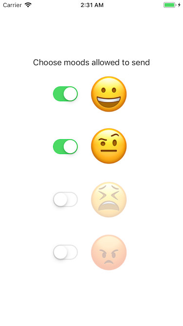
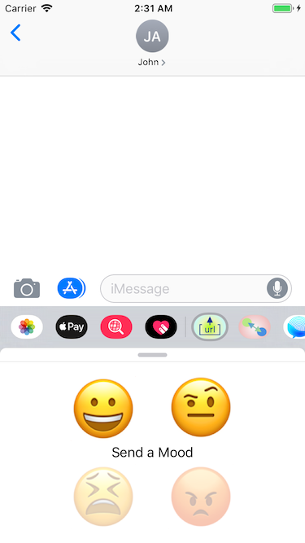

# imPiggie
See the overall rationale in the [readme in the parent folder](../README.md).

Same as imUrlData but adding a usable iOS App side rather than just appearing as an extension and **sending custom messages from the App**.

## Shared Features
We are not trying to share any significant logic between the two sides. One complicating factor is that MessagesViewController is a MSMessagesAppViewController.

If we wanted to have common UI would need it to be nested ViewControllers inside that.

However, to make it interesting, we **do** want the app to influence the behaviour of the message extension, so we allow it to set _which moods_ are available. The values are stored in a simple plist file, managed by `SharedData.swift` and both app and extension are members of an _AppGroup_.

This mimics a common pattern - put the _Settings_ features into the main app.

Note another strong reason to have the companion app installable is to support In-App Purchases as these are not officially supported in iMessage extensions.

| App with two buttons disabled | Messenger showing matching state |  
|:------:|:------:|  
|  |   |

## Sending from the App

Apple provide [MFMessageComposeViewController](https://developer.apple.com/documentation/messageui/mfmessagecomposeviewcontroller) so you can compose messages inside an app. This is documented as being mostly about sending text **but** you can also assign the `message` property which is an `MSMessage`. The documentation misleadingly says _To display your iMessage app, create and assign an MSMessage object to this property._ but there's no such automatic behaviour. 

What _does_ seem to happen, magically behind the scene, is that the iMessage delivered is typed for the iMessage Extension App bundled with your sending app. ie: **you can only use this technique when there's an extension.** 

That makes absolute sense when you think about it - the app may be used to _send_ custom messages, but custom messages can _only be received in an extension._

## Project Structure

Created using XCode 10.1 as a Single View App then *added* an iMessage App Extension second target.

**Important Note** When you create an iMessage app like imUrlData you have a .app target generated as part of the project. However, that's a very specialised host for the iMessage App Extension and can **not** be converted into a standard app.

The way to go is as shown in this sample - start with a _normal_ app and **add** an iMessage App Extension to it.

If you look in the git history of this sample you will see how I made the mistake of starting with a plain copy of imUrlData and tried to modify its app into a real one. On realising, and researching, that this is impossible, I started over with a Single View App.